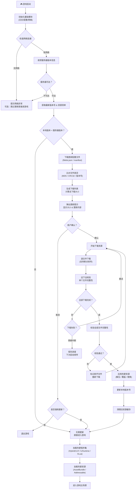

# Unity3D 游戏热更新流程

## 关键步骤说明

| 步骤 | 说明 |
|------|------|
| 版本比对 | 通过服务器版本号与本地版本号比较，判断是否需要更新 |
| 差异比对 | 逐文件比对 MD5 / CRC，只下载有变化的文件，减少流量 |
| 断点续传 | 下载中断后记录进度，下次启动从断点继续 |
| 完整性校验 | 下载完成后校验文件，确保未被篡改或损坏 |
| 资源应用 | 将下载的 AssetBundle / DLL / Lua 脚本覆盖到本地 |
| 热更程序集 | 通过 HybridCLR / ILRuntime / XLua 加载热更代码 |

注意：
 使用addressableSystem进行热更时，要想实现在游戏开始运行时执行下载更新过程，则需要注意
 - 1. 生成catalog文件（buildCatalog选项），在addressable的settiing文件里配置，
 - 2. 然后需要手动更新，不要addressable初始化时，就自动下载更新catalag了
